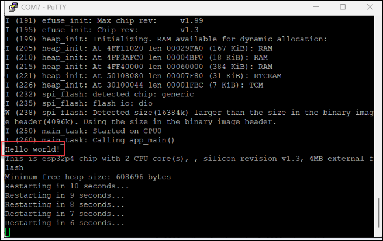

# ESP32-P4-EYE Hello World Build and Flash Guide

This guide covers building and flashing the ESP-IDF Hello World example for ESP32-P4-EYE vision development board.

Table of Contents:
- [Build Process (On AWS SageMaker/Linux)](#build-process-on-aws-sagemakerlinux)
- [Flash Process (On Windows PC)](#flash-process-on-windows-pc)
- [Verify Installation](#verify-installation)
- [Appendix](#appendix)


## Build Process (On AWS SageMaker/Linux)
### 1. Setup ESP-IDF Environment
```bash
# Navigate to ESP-IDF directory
cd ~/SageMaker/esp/esp-idf

# Install ESP-IDF tools
./install.sh all

# Setup environment variables
source ./export.sh
```
### 2. Configure and Build Project
```bash
# Navigate to Hello World example
cd /home/ec2-user/SageMaker/esp/esp-idf/examples/get-started/hello_world

# Set target chip to ESP32-P4
idf.py set-target esp32p4

# Build the project
idf.py build
```

### 3. Build Output
After successful build, you'll see:
```bash
Project build complete. To flash, run:
 idf.py flash
or
 idf.py -p PORT flash
or
 python -m esptool --chip esp32p4 -b 460800 --before default_reset --after hard_reset write_flash --flash_mode dio --flash_size 2MB --flash_freq 80m 0x2000 build/bootloader/bootloader.bin 0x8000 build/partition_table/partition-table.bin 0x10000 build/hello_world.bin
```
You can find the build artifacts in the `build/` directory.

### 4. Download Binary Files
Download these three files from the build/ directory:
- build/bootloader/bootloader.bin - Bootloader image
- build/partition_table/partition-table.bin - Partition table
- build/hello_world.bin - Application firmware


## Flash Process (On Windows PC)
### 1. Install esptool
```bash
pip install esptool
```

### 2. Identify Serial Port  
Connect ESP32-P4 board via USB  
Check Device Manager to identify COM port (e.g., COM7)

### 3. Flash Firmware
Navigate to the directory containing the downloaded .bin files, then run:
```bash
python -m esptool -p COM7 --chip esp32p4 -b 115200 --no-stub --before default-reset --after hard-reset write_flash --flash-mode dio --flash-size 4MB --flash-freq 80m 0x2000 ./bootloader.bin 0x8000 ./partition-table.bin 0x10000 ./hello_world.bin
```
Adjust `-p COM7` to your actual COM port.


## Verify Installation
### Using PuTTY (Windows)
1. Open PuTTY
2. Configure connection:
   - Connection Type: Serial
   - Serial Line: COM7 (your device port)
   - Speed (baud rate): 115200
3. Click "Open"
4. Press reset button on ESP32-P4 board
5. You should see Hello World output in the terminal  
    


## Appendix
### Flash Command Parameters

| Parameter | Value | Description |
|-----------|-------|-------------|
| `-p` | COM7 | Serial port (adjust based on your system) |
| `--chip` | esp32p4 | Target chip type |
| `-b` | 115200 | Baud rate for flashing |
| `--flash-mode` | dio | Flash mode (Dual I/O) |
| `--flash-size` | 4MB | Flash memory size |
| `--flash-freq` | 80m | Flash frequency (80MHz) |

### Memory Addresses

| Address | File | Purpose |
|---------|------|---------|
| 0x2000 | bootloader.bin | Second stage bootloader |
| 0x8000 | partition-table.bin | Partition table |
| 0x10000 | hello_world.bin | Application code |