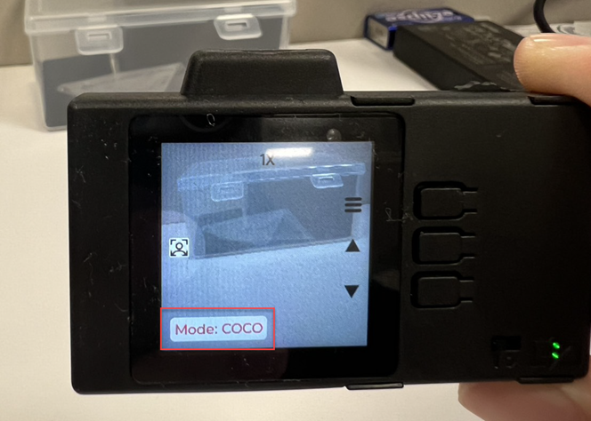

# ESP32-P4-EYE Add Custom Detection Model Guide

This guide covers adding a custom object detection model (COCO Dataset) to the ESP32-P4-EYE factory demo firmware.

## Table of Contents
- [Modification Steps](#modification-steps)
- [Build and Flash](#build-and-flash)
- [Verify Installation](#verify-installation)


## Modification Steps

### Step 1: Modify Mode Definitions
`cd esp/esp-dev-kits/examples/esp32-p4-eye/examples/factory_demo/`

**File:** `./main/ui/ui_extra.h`

Add `AI_DETECT_COCO` to the detection mode enumeration. Based on the original code, PEDESTRIAN is 0 and FACE is 1.
```c
typedef enum {
    AI_DETECT_PEDESTRIAN = 0, // Pedestrian detection
    AI_DETECT_FACE,           // Face detection
    AI_DETECT_COCO,           // COCO object detection (value = 2) [⚠️ MUST be on third line]
    AI_DETECT_MODE_MAX        // Maximum number of modes
} ai_detect_mode_t;
```

**Important:** `AI_DETECT_COCO` must be placed as the third entry (index 2) in the enum.

---

### Step 2: Update AI Processing Logic

**File:** `./main/app/AI/app_ai_detect.cpp`

You must add COCO detection paths to the backend task and frame processing functions.

#### 2.1 Modify Detection Task

In the `camera_dectect_task` function, add COCO detection call:
```c
if (ui_extra_get_ai_detect_mode() == AI_DETECT_PEDESTRIAN) {
    detect_results = app_pedestrian_detect((uint16_t *)p->buffer, DETECT_WIDTH, DETECT_HEIGHT);
} else if (ui_extra_get_ai_detect_mode() == AI_DETECT_FACE) {
    detect_results = app_humanface_detect((uint16_t *)p->buffer, DETECT_WIDTH, DETECT_HEIGHT);
} else if (ui_extra_get_ai_detect_mode() == AI_DETECT_COCO) {
    // Call COCO detection function defined in source
    detect_results = app_coco_detect((uint16_t *)p->buffer, DETECT_WIDTH, DETECT_HEIGHT);
}
```

#### 2.2 Modify Frame Processing

In `app_ai_detection_process_frame`, chain the drawing logic:
```c
if(ai_detect_mode == AI_DETECT_FACE) {
    ret = app_humanface_ai_detect((uint16_t*)current_ai_buffer, (uint16_t*)detect_buf, width, height);
} else if(ai_detect_mode == AI_DETECT_PEDESTRIAN) {
    ret = app_pedestrian_ai_detect((uint16_t*)current_ai_buffer, (uint16_t*)detect_buf, width, height);
} else if(ai_detect_mode == AI_DETECT_COCO) {
    // Call drawing function implemented in source, which handles YOLO boxes and text labels
    ret = app_coco_od_detect((uint16_t*)detect_buf, width, height); 
}
```

---

### Step 3: Update UI Label Display

**File:** `./main/ui/ui_extra.c`

Modify the `ui_extra_update_ai_detect_mode_label` function to display "Mode: COCO" in the UI:
```c
static void ui_extra_update_ai_detect_mode_label(void) {
    if (ai_mode_label == NULL) return;

    if (current_ai_detect_mode == AI_DETECT_PEDESTRIAN) {
        lv_label_set_text(ai_mode_label, "Mode: Pedestrian");
    } else if (current_ai_detect_mode == AI_DETECT_FACE) {
        lv_label_set_text(ai_mode_label, "Mode: Face");
    } else if (current_ai_detect_mode == AI_DETECT_COCO) {
        lv_label_set_text(ai_mode_label, "Mode: COCO"); // Add display text
    }
}
```

---

### Step 4: Implement UI Button Switching Logic

**File:** `./main/ui/ui_extra.c`

The current UI uses up/down buttons to switch modes. Modify the `ui_extra_btn_up` and `ui_extra_btn_down` switch-case logic to support cycling through three modes.

#### 4.1 Down Button (Next Mode)

Add to the `ui_extra_btn_down` function:
```c
case UI_PAGE_AI_DETECT:
    if (current_ai_detect_mode == AI_DETECT_PEDESTRIAN) {
        ui_extra_change_ai_detect_mode(AI_DETECT_FACE);
    } else if (current_ai_detect_mode == AI_DETECT_FACE) {
        ui_extra_change_ai_detect_mode(AI_DETECT_COCO); // Switch to COCO
    } else {
        ui_extra_change_ai_detect_mode(AI_DETECT_PEDESTRIAN); // Cycle back to first
    }
    break;
```

#### 4.2 Up Button (Previous Mode)

Add to the `ui_extra_btn_up` function:
```c
case UI_PAGE_AI_DETECT:
    if (current_ai_detect_mode == AI_DETECT_PEDESTRIAN) {
        ui_extra_change_ai_detect_mode(AI_DETECT_COCO); // Go to last mode (COCO)
    } else if (current_ai_detect_mode == AI_DETECT_COCO) {
        ui_extra_change_ai_detect_mode(AI_DETECT_FACE);
    } else {
        ui_extra_change_ai_detect_mode(AI_DETECT_PEDESTRIAN);
    }
    break;
```

---

## Build and Flash

### 1. Navigate to Factory Demo Directory
```bash
cd ~/SageMaker/esp/esp-dev-kits/examples/esp32-p4-eye/examples/factory_demo
```

### 2. Set Target to ESP32-P4
```bash
idf.py set-target esp32p4
```

### 3. Build Modified Project
```bash
idf.py build
```

### 4. Build Output

After successful build, you'll see:
```bash
Project build complete. To flash, run:
 idf.py flash
or
 idf.py -p PORT flash
or
 python -m esptool --chip esp32p4 -b 460800 --before default_reset --after hard_reset write_flash --flash-mode dio --flash-size 16MB --flash-freq 40m 0x2000 build/bootloader/bootloader.bin 0x8000 build/partition_table/partition-table.bin 0x10000 build/factory_demo.bin
```

### 5. Download Binary Files

Download these three files from the `build/` directory:

- `build/bootloader/bootloader.bin`
- `build/partition_table/partition-table.bin`
- `build/factory_demo.bin`

### 6. Flash to Device (On Windows PC)

Navigate to the directory containing the downloaded `.bin` files, then run:
```bash
python -m esptool -p COM7 --chip esp32p4 -b 115200 --no-stub --before default_reset --after hard-reset write_flash --flash-mode dio --flash-size 16MB --flash-freq 80m 0x2000 bootloader.bin 0x8000 partition-table.bin 0x10000 factory_demo.bin
```

**Adjust `-p COM7` to your actual COM port.**

---

## Verify Installation

### 1. Power On and Navigate to AI Detection
### 2. Testing Mode Switching

On the ESP32-P4-EYE display:
1. Navigate to **AI Detection** page
2. Press **Down button** to cycle through modes:
   - Pedestrian → Face → COCO → Pedestrian (cycles)
3. Press **Up button** to cycle in reverse:
   - Pedestrian → COCO → Face → Pedestrian (reverse cycles)
4. Verify **"Mode: COCO"** label appears when COCO mode is selected



### Detection Mode Flow
```
Button Press (Down)
    ↓
UI_PAGE_AI_DETECT case
    ↓
Check current_ai_detect_mode
    ↓
├─ PEDESTRIAN → switch to FACE
├─ FACE → switch to COCO
└─ COCO → switch to PEDESTRIAN (cycle)
    ↓
ui_extra_change_ai_detect_mode(new_mode)
    ↓
Update UI label & backend mode
```