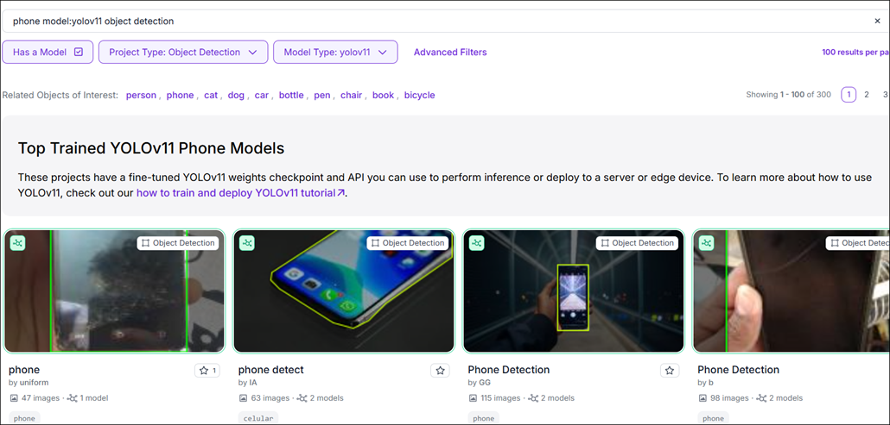
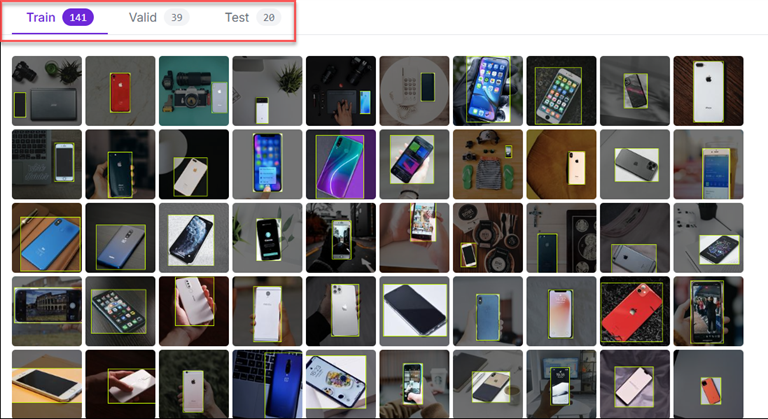
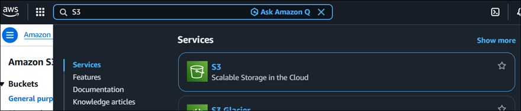
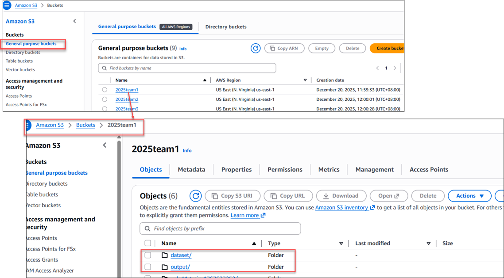
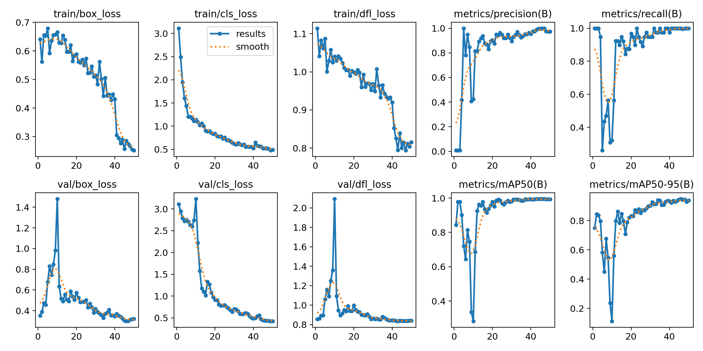
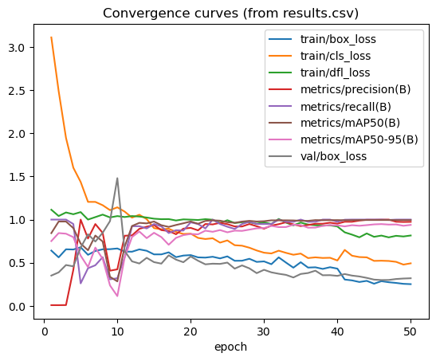
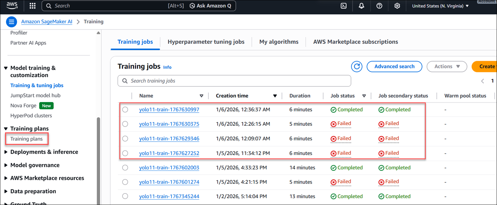
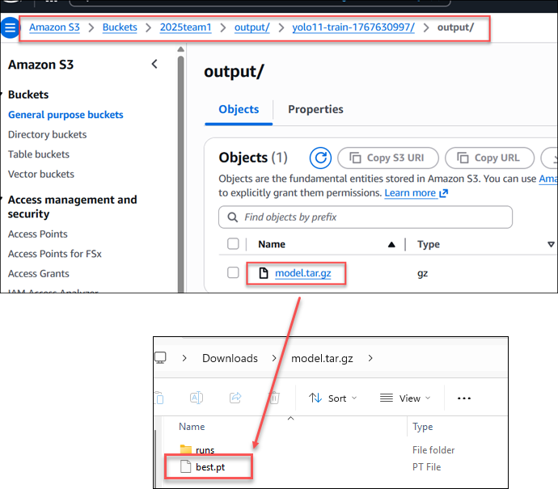

# ESP32-P4-EYE Train & Apply Custom YOLO Model Guide (Work in Progress)

This guide covers the complete workflow for training a custom YOLO11 object detection model on AWS SageMaker and deploying it to ESP32-P4-EYE.

table of Contents:
- [overall steps](#overall-steps)
- [prepare dataset](#prepare-dataset)
- [SageMaker Training Job](#sagemaker-training-job)
- [Convert And Deploy](#convert-and-deploy)

## overall steps
```
Dataset (Roboflow)
↓
Download & Prepare
↓
Upload to S3
↓
SageMaker Training Job (GPU)
↓
Download best.pt
↓
Convert to .onnx, .espdl format
↓
Flash to ESP32-P4-EYE
```

## prepare dataset

1. Go to Roboflow and find your dataset
    

    

    folder structure should be like this:
    ```
    ├── data.yaml
    ├── images/
    │   ├── train/
    │   │   ├── img001.jpg
    │   │   ├── img002.jpg
    │   │   └── ...
    │   └── val/
    │       ├── img101.jpg
    │       └── ...    
    ├── labels/
    │   ├── train/
    │   │   ├── img001.txt
    │   │   ├── img002.txt
    │   │   └── ...
    │   └── val/
    │       ├── img101.txt
    │       └── ...
    ```

2. upload the zip file to your S3 bucket
    

    


## SageMaker Training Job

此 Notebook 會：
1. 生成訓練程式 `train.py` 與 `requirements.txt`
2. 以 **SageMaker PyTorch Estimator** 啟動 Training Job
3. 在 Notebook 內**串流顯示訓練日誌**，並**嘗試動態解析每個 epoch 指標，畫出收斂曲線**
4. 訓練完成後下載 artifacts（含 `best.pt`、`runs/`、`results.csv`、`results.png`）並顯示完整曲線

> 注意：動態曲線解析依賴 Ultralytics 日誌格式；若版本輸出不同，可能解析不到，但**訓練完成後**一定能用 `results.csv/results.png` 畫出完整收斂曲線。

> 🚩 先執行: `!pip install -U ultralytics opencv-python`

## 0) 先決條件

- 已在 SageMaker Studio / Notebook Instance 執行
- IAM role 具備 SageMaker 與 S3 權限
- 你已把 YOLO 格式資料集打包成 zip 放在 S3

資料 zip 內部建議結構：
```
mydata/
  images/train
  images/val
  labels/train
  labels/val
```


```python
import os, json, tarfile, re, time
from pathlib import Path

import boto3
import sagemaker
from sagemaker.pytorch import PyTorch
from sagemaker.inputs import TrainingInput
from sagemaker.s3 import S3Downloader

import pandas as pd
import matplotlib.pyplot as plt
from IPython.display import display, clear_output, Image

sess = sagemaker.Session()
region = sess.boto_region_name
role = sagemaker.get_execution_role()
sm = boto3.client('sagemaker', region_name=region)
logs = boto3.client('logs', region_name=region)

print('region:', region)
print('default bucket:', sess.default_bucket())

```

    region: us-east-1
    default bucket: sagemaker-us-east-1-049281306005


### 1) 參數設定（請改成你的 S3 路徑與類別名稱）


```python
# ====== 你要改的地方 ======
S3_DATA_ZIP = 's3://2025team1/dataset/mobile_detect.yolov11.zip'  # <<<<<< 改成你的資料集
DATA_ZIP_FILENAME = 'mobile_detect.yolov11.zip'           # zip 檔名

# 類別名稱（請改成你的 classes）
CLASS_NAMES = ['class0', 'class1']

# YOLO11 權重（可改 yolo11s.pt / yolo11m.pt / yolo11l.pt / yolo11x.pt）
YOLO_MODEL = 'yolo11n.pt'

# 訓練超參數
EPOCHS = 50
IMGSZ = 640
BATCH = 16
WORKERS = 4

# 訓練硬體（推薦 GPU：g5 / g4dn）
INSTANCE_TYPE = 'ml.g5.2xlarge'
INSTANCE_COUNT = 1

# 輸出到 S3
OUTPUT_S3 = f"s3://2025team1/output/"

print('S3_DATA_ZIP:', S3_DATA_ZIP)
print('OUTPUT_S3:', OUTPUT_S3)

```

    S3_DATA_ZIP: s3://2025team1/dataset/mobile_detect.yolov11.zip
    OUTPUT_S3: s3://2025team1/output/


### 2) 生成訓練程式碼（train.py）與 requirements.txt

重點：
- SageMaker 會把 `training` channel 掛載在 `/opt/ml/input/data/training/`
- 你要把 artifacts 寫到 `/opt/ml/model/`，SageMaker 才會上傳到 `output_path`
- 我們把 Ultralytics 的 `runs/` 放到 `/opt/ml/model/runs/`，方便事後下載 `results.csv` / `results.png`


```python
src_dir = Path('src')
src_dir.mkdir(exist_ok=True)

train_py = r'''
import argparse
import base64
import json
import zipfile
import shutil
from pathlib import Path
import yaml
from ultralytics import YOLO

def main():
    p = argparse.ArgumentParser()
    p.add_argument('--data_zip', type=str, default='mydata.zip')
    p.add_argument('--model', type=str, default='yolo11n.pt')
    p.add_argument('--epochs', type=int, default=50)
    p.add_argument('--imgsz', type=int, default=640)
    p.add_argument('--batch', type=int, default=16)
    p.add_argument('--workers', type=int, default=4)

    # ✅ 改成 base64，避免 argv 被拆
    p.add_argument('--class_names_b64', type=str, required=True)

    args = p.parse_args()

    # ✅ 解碼回 list[str]
    class_names = json.loads(base64.b64decode(args.class_names_b64).decode("utf-8"))

    sm_data_dir = Path('/opt/ml/input/data/training')
    sm_model_dir = Path('/opt/ml/model')
    sm_model_dir.mkdir(parents=True, exist_ok=True)

    work_dir = Path('/tmp/data')
    work_dir.mkdir(parents=True, exist_ok=True)

    zip_path = sm_data_dir / args.data_zip
    with zipfile.ZipFile(zip_path, 'r') as z:
        z.extractall(work_dir)

    entries = [d for d in work_dir.iterdir() if d.is_dir()]
    dataset_root = entries[0] if entries else work_dir

    data_yaml = {
        'path': str(dataset_root),
        'train': 'images/train',
        'val': 'images/val',
        'names': class_names,
    }
    yaml_path = work_dir / 'data.yaml'
    with open(yaml_path, 'w') as f:
        yaml.safe_dump(data_yaml, f)

    model = YOLO(args.model)
    project_dir = sm_model_dir / 'runs'
    model.train(
        data=str(yaml_path),
        epochs=args.epochs,
        imgsz=args.imgsz,
        batch=args.batch,
        workers=args.workers,
        project=str(project_dir),
        name='train',
        verbose=True,
    )

    best_pt = project_dir / 'train' / 'weights' / 'best.pt'
    if best_pt.exists():
        shutil.copy2(best_pt, sm_model_dir / 'best.pt')

if __name__ == '__main__':
    main()

'''

(src_dir / 'train.py').write_text(train_py, encoding='utf-8')
(src_dir / 'requirements.txt').write_text('ultralytics\nopencv-python\npyyaml\n', encoding='utf-8')
print('Wrote:', src_dir / 'train.py')
print('Wrote:', src_dir / 'requirements.txt')

```

    Wrote: src/train.py
    Wrote: src/requirements.txt


### 3) 建立 Estimator 並啟動 Training Job（非阻塞）


```python
import base64, json

class_names_b64 = base64.b64encode(
    json.dumps(CLASS_NAMES, ensure_ascii=False).encode("utf-8")
).decode("ascii")

hyperparameters = {
    "data_zip": DATA_ZIP_FILENAME,
    "model": YOLO_MODEL,
    "epochs": EPOCHS,
    "imgsz": IMGSZ,
    "batch": BATCH,
    "workers": WORKERS,
    "class_names_b64": class_names_b64,
}

est = PyTorch(
    entry_point='train.py',
    source_dir=str(src_dir),
    role=role,
    framework_version='2.2',
    py_version='py310',
    instance_count=INSTANCE_COUNT,
    instance_type=INSTANCE_TYPE,
    hyperparameters=hyperparameters,
    output_path=OUTPUT_S3,
)

job_name = f"yolo11-train-{int(time.time())}"
print('TrainingJobName:', job_name)

est.fit(
    inputs={'training': TrainingInput(S3_DATA_ZIP, content_type='application/zip')},
    job_name=job_name,
    wait=False,
)
print('已送出 Training Job。接著跑下一格開始動態監控。')

```

    INFO:sagemaker.telemetry.telemetry_logging:SageMaker Python SDK will collect telemetry to help us better understand our user's needs, diagnose issues, and deliver additional features.
    To opt out of telemetry, please disable via TelemetryOptOut parameter in SDK defaults config. For more information, refer to https://sagemaker.readthedocs.io/en/stable/overview.html#configuring-and-using-defaults-with-the-sagemaker-python-sdk.
    INFO:sagemaker.image_uris:image_uri is not presented, retrieving image_uri based on instance_type, framework etc.
    INFO:sagemaker:Creating training-job with name: yolo11-train-1767630997


    TrainingJobName: yolo11-train-1767630997
    已送出 Training Job。接著跑下一格開始動態監控。


### 4) 動態顯示訓練過程與收斂曲線（即時）

會從 CloudWatch Logs 拉取最新日誌並嘗試解析 epoch 指標。


```python
import boto3, re

logs = boto3.client("logs", region_name=region)

def list_sagemaker_log_groups(prefix_hint="/aws/sagemaker"):
    resp = logs.describe_log_groups(logGroupNamePrefix=prefix_hint, limit=50)
    return [g["logGroupName"] for g in resp.get("logGroups", [])]

print("\n".join(list_sagemaker_log_groups()))
desc = sm.describe_training_job(TrainingJobName=job_name)
print("TrainingJobArn =", desc["TrainingJobArn"])

```

    /aws/sagemaker/NotebookInstances
    /aws/sagemaker/TrainingJobs
    TrainingJobArn = arn:aws:sagemaker:us-east-1:049281306005:training-job/yolo11-train-1767630997


```python
import time
import re
import pandas as pd
import matplotlib.pyplot as plt
import boto3
from IPython.display import display, clear_output

# ------------------------------------------------------------
# 1) 先用原本的 sm 取得 TrainingJobArn，反推出 job 的 region
# ------------------------------------------------------------
desc = sm.describe_training_job(TrainingJobName=job_name)
training_job_arn = desc["TrainingJobArn"]
job_region = training_job_arn.split(":")[3]

print("TrainingJobArn:", training_job_arn)
print("Job region    :", job_region)

# ------------------------------------------------------------
# 2) 用「job 的 region」重新建立 clients（關鍵修正點）
# ------------------------------------------------------------
logs = boto3.client("logs", region_name=job_region)
sm2  = boto3.client("sagemaker", region_name=job_region)

print("CloudWatch logs region =", logs.meta.region_name)
print("SageMaker client region =", sm2.meta.region_name)

# ------------------------------------------------------------
# 3) 重新定義 helper functions（只差在用 sm2 / logs）
# ------------------------------------------------------------
def get_training_job_status(job_name: str):
    d = sm2.describe_training_job(TrainingJobName=job_name)
    return d["TrainingJobStatus"], d

def find_log_stream(job_name: str, log_group="/aws/sagemaker/TrainingJobs"):
    paginator = logs.get_paginator("describe_log_streams")
    for page in paginator.paginate(
        logGroupName=log_group,
        logStreamNamePrefix=job_name
    ):
        streams = page.get("logStreams", [])
        if streams:
            streams = sorted(
                streams,
                key=lambda s: s.get("lastEventTimestamp", 0),
                reverse=True
            )
            return streams[0]["logStreamName"]
    return None

def fetch_logs(log_group, log_stream, next_token=None):
    kwargs = dict(
        logGroupName=log_group,
        logStreamName=log_stream,
        startFromHead=True
    )
    if next_token:
        kwargs["nextToken"] = next_token
    resp = logs.get_log_events(**kwargs)
    return resp.get("events", []), resp.get("nextForwardToken")

# ------------------------------------------------------------
# 4) epoch log best-effort parser（不變）
# ------------------------------------------------------------
epoch_metrics = []
epoch_line_re = re.compile(
    r"^\s*(\d+)\s+([0-9.eE+-]+)\s+([0-9.eE+-]+)\s+([0-9.eE+-]+)\s+([0-9.eE+-]+)\s+([0-9.eE+-]+)"
)

def try_parse_epoch_line(msg: str):
    m = epoch_line_re.match(msg)
    if not m:
        return None
    epoch = int(m.group(1))
    vals = [float(m.group(i)) for i in range(2, 7)]
    return {
        "epoch": epoch,
        "v1": vals[0],
        "v2": vals[1],
        "v3": vals[2],
        "v4": vals[3],
        "v5": vals[4],
    }

# ------------------------------------------------------------
# 5) 找 log stream（現在一定在正確 region）
# ------------------------------------------------------------
log_group = "/aws/sagemaker/TrainingJobs"
log_stream = None
token = None
seen = set()
tail = []

print("尋找 CloudWatch Log Stream...")
for _ in range(60):
    log_stream = find_log_stream(job_name, log_group=log_group)
    if log_stream:
        break
    time.sleep(5)

if not log_stream:
    raise RuntimeError(
        f"找不到 log stream（job_name={job_name}，region={job_region}）"
    )

print("log_group :", log_group)
print("log_stream:", log_stream)

# ------------------------------------------------------------
# 6) 即時監控 + 動態收斂曲線
# ------------------------------------------------------------
while True:
    status, desc = get_training_job_status(job_name)

    events, token = fetch_logs(log_group, log_stream, token)
    new_lines = []

    for e in events:
        key = (e.get("timestamp"), e.get("message"))
        if key in seen:
            continue
        seen.add(key)

        msg = (e.get("message") or "").rstrip("\n")
        if not msg:
            continue

        new_lines.append(msg)

        parsed = try_parse_epoch_line(msg)
        if parsed:
            if not epoch_metrics or parsed["epoch"] != epoch_metrics[-1]["epoch"]:
                epoch_metrics.append(parsed)

    tail = (tail + new_lines)[-50:]

    clear_output(wait=True)
    print("TrainingJob:", job_name)
    print("Status     :", status)
    print("Region     :", job_region)
    print("----- logs tail -----")
    for line in tail:
        print(line)

    if len(epoch_metrics) >= 2:
        df_live = pd.DataFrame(epoch_metrics).sort_values("epoch")
        display(df_live.tail(10))

        plt.figure()
        plt.plot(df_live["epoch"], df_live["v1"], label="v1")
        plt.plot(df_live["epoch"], df_live["v2"], label="v2")
        plt.plot(df_live["epoch"], df_live["v3"], label="v3")
        plt.xlabel("epoch")
        plt.legend()
        plt.title("Live convergence (parsed from CloudWatch logs)")
        plt.show()

    if status in ["Completed", "Failed", "Stopped"]:
        print("\nTraining job finished with status:", status)
        if status != "Completed":
            print("FailureReason:", desc.get("FailureReason"))
        break

    time.sleep(10)

```

    TrainingJob: yolo11-train-1767630997
    Status     : Completed
    Region     : us-east-1
    ----- logs tail -----
    ...
    all         39         39      0.972          1      0.994      0.928
    Epoch    GPU_mem   box_loss   cls_loss   dfl_loss  Instances       Size
    #033[K      50/50      2.61G      0.256     0.4896     0.7991         16        640: 11% ━─────────── 1/9 1.9it/s 0.2s<4.2s
    #033[K      50/50      2.61G     0.2598      0.483     0.8168         16        640: 22% ━━╸───────── 2/9 4.0it/s 0.3s<1.7s
    #033[K      50/50      2.61G     0.2738     0.5036     0.8141         16        640: 44% ━━━━━─────── 4/9 6.5it/s 0.4s<0.8s
    #033[K      50/50      2.61G     0.2629     0.4972     0.8201         17        640: 67% ━━━━━━━━──── 6/9 7.8it/s 0.6s<0.4s
    #033[K      50/50      2.61G     0.2516     0.4929     0.8156         13        640: 89% ━━━━━━━━━━╸─ 8/9 9.2it/s 0.8s<0.1s#015#033[K      50/50      2.61G     0.2516     0.4929     0.8156         13        640: 100% ━━━━━━━━━━━━ 9/9 11.6it/s 0.8s#015#033[K      50/50      2.61G     0.2516     0.4929     0.8156         13        640: 100% ━━━━━━━━━━━━ 9/9 11.6it/s 0.8s
    #033[K                 Class     Images  Instances      Box(P          R      mAP50  mAP50-95): 50% ━━━━━━────── 1/2 2.8it/s 0.1s<0.4s
    #033[K                 Class     Images  Instances      Box(P          R      mAP50  mAP50-95): 100% ━━━━━━━━━━━━ 2/2 13.3it/s 0.2s#015#033[K                 Class     Images  Instances      Box(P          R      mAP50  mAP50-95): 100% ━━━━━━━━━━━━ 2/2 13.3it/s 0.2s
    all         39         39      0.974          1      0.994      0.938
    50 epochs completed in 0.018 hours.
    ...
    Results saved to #033[1m/opt/ml/model/runs/train#033[0m
    2026-01-05 16:42:47,154 sagemaker-training-toolkit INFO     Waiting for the process to finish and give a return code.
    2026-01-05 16:42:47,154 sagemaker-training-toolkit INFO     Done waiting for a return code. Received 0 from exiting process.
    2026-01-05 16:42:47,154 sagemaker-training-toolkit INFO     Reporting training SUCCESS
    
    Training job finished with status: Completed


### 5) 下載 artifacts 並畫出完整收斂曲線（results.csv / results.png）


```python
while True:
    status, _ = get_training_job_status(job_name)
    if status in ['Completed', 'Failed', 'Stopped']:
        print('Final status:', status)
        break
    time.sleep(20)

if status != 'Completed':
    raise RuntimeError(f'Training job not completed: {status}')

desc = sm.describe_training_job(TrainingJobName=job_name)
model_artifact = desc['ModelArtifacts']['S3ModelArtifacts']
print('Model artifact:', model_artifact)

out_dir = Path('artifacts') / job_name
out_dir.mkdir(parents=True, exist_ok=True)

S3Downloader.download(model_artifact, str(out_dir))
local_tar = out_dir / 'model.tar.gz'
print('Downloaded:', local_tar)

with tarfile.open(local_tar, 'r:gz') as t:
    t.extractall(path=out_dir)

best_pt = out_dir / 'best.pt'
results_png = out_dir / 'runs' / 'train' / 'results.png'
results_csv = out_dir / 'runs' / 'train' / 'results.csv'

print('best.pt exists:', best_pt.exists())
print('results.png exists:', results_png.exists())
print('results.csv exists:', results_csv.exists())

if results_png.exists():
    display(Image(filename=str(results_png)))

if results_csv.exists():
    df = pd.read_csv(results_csv)
    display(df.head())

    cols = [c for c in df.columns if c.lower() not in ['epoch', 'time']]
    x = df['epoch'] if 'epoch' in df.columns else range(len(df))

    to_plot = cols[:8]
    plt.figure()
    for c in to_plot:
        plt.plot(x, df[c], label=c)
    plt.xlabel('epoch')
    plt.legend()
    plt.title('Convergence curves (from results.csv)')
    plt.show()
else:
    print('找不到 results.csv；請確認 runs/ 是否有被寫入 /opt/ml/model/runs')

```

    Final status: Completed
    Model artifact: s3://2025team1/output/yolo11-train-1767630997/output/model.tar.gz
    Downloaded: artifacts/yolo11-train-1767630997/model.tar.gz
    best.pt exists: True
    results.png exists: True
    results.csv exists: True


> 這 10 張圖的 x 軸都是 epoch（第幾輪訓練），y 軸是損失或評估指標的數值；重點是看「訓練 loss 有沒有下降、驗證指標（precision / recall / mAP）有沒有穩定上升且不發散」。  
    1. y 軸：Bounding Box 回歸誤差（位置準不準）(越低越好)  
    2. y 軸：分類誤差（物件是什麼類） (越低越好)
    3. 下排左三張：Validation Loss y 軸：模型在「沒看過的資料」上的誤差 (越低越好)  
    4. metrics/mAP50(B) 偏「寬鬆」，接近實務是否抓得到
    5. metrics/mAP50-95(B) 很嚴格（框要很準）



| 檢查項目          | 你的結果 |
| ------------- | ---- |
| Train loss 下降 | ✅    |
| Val loss 不發散  | ✅    |
| Precision 高   | ✅    |
| Recall 高      | ✅    |
| mAP50 高       | ✅    |
| mAP50-95 穩定   | ✅    |
| Overfitting   | ❌ 沒有 |


<div>
<style scoped>
    .dataframe tbody tr th:only-of-type {
        vertical-align: middle;
    }

    .dataframe tbody tr th {
        vertical-align: top;
    }

    .dataframe thead th {
        text-align: right;
    }
</style>
<table border="1" class="dataframe">
  <thead>
    <tr style="text-align: right;">
      <th></th>
      <th>epoch</th>
      <th>time</th>
      <th>train/box_loss</th>
      <th>train/cls_loss</th>
      <th>train/dfl_loss</th>
      <th>metrics/precision(B)</th>
      <th>metrics/recall(B)</th>
      <th>metrics/mAP50(B)</th>
      <th>metrics/mAP50-95(B)</th>
      <th>val/box_loss</th>
      <th>val/cls_loss</th>
      <th>val/dfl_loss</th>
      <th>lr/pg0</th>
      <th>lr/pg1</th>
      <th>lr/pg2</th>
    </tr>
  </thead>
  <tbody>
    <tr>
      <th>0</th>
      <td>1</td>
      <td>3.36210</td>
      <td>0.64075</td>
      <td>3.11215</td>
      <td>1.11440</td>
      <td>0.00817</td>
      <td>1.00000</td>
      <td>0.84283</td>
      <td>0.75079</td>
      <td>0.35101</td>
      <td>3.10815</td>
      <td>0.85661</td>
      <td>0.000133</td>
      <td>0.000133</td>
      <td>0.000133</td>
    </tr>
    <tr>
      <th>1</th>
      <td>2</td>
      <td>4.77159</td>
      <td>0.56221</td>
      <td>2.48942</td>
      <td>1.04130</td>
      <td>0.00801</td>
      <td>1.00000</td>
      <td>0.97753</td>
      <td>0.84357</td>
      <td>0.38801</td>
      <td>2.94903</td>
      <td>0.86088</td>
      <td>0.000278</td>
      <td>0.000278</td>
      <td>0.000278</td>
    </tr>
    <tr>
      <th>2</th>
      <td>3</td>
      <td>6.14126</td>
      <td>0.65557</td>
      <td>1.94710</td>
      <td>1.08263</td>
      <td>0.00900</td>
      <td>1.00000</td>
      <td>0.97751</td>
      <td>0.83645</td>
      <td>0.47309</td>
      <td>2.79097</td>
      <td>0.89218</td>
      <td>0.000416</td>
      <td>0.000416</td>
      <td>0.000416</td>
    </tr>
    <tr>
      <th>3</th>
      <td>4</td>
      <td>7.41680</td>
      <td>0.65320</td>
      <td>1.60130</td>
      <td>1.06209</td>
      <td>0.41777</td>
      <td>0.94872</td>
      <td>0.90134</td>
      <td>0.79629</td>
      <td>0.45788</td>
      <td>2.71875</td>
      <td>0.89499</td>
      <td>0.000549</td>
      <td>0.000549</td>
      <td>0.000549</td>
    </tr>
    <tr>
      <th>4</th>
      <td>5</td>
      <td>8.71619</td>
      <td>0.67936</td>
      <td>1.43627</td>
      <td>1.08687</td>
      <td>1.00000</td>
      <td>0.26041</td>
      <td>0.72132</td>
      <td>0.58154</td>
      <td>0.67598</td>
      <td>2.75434</td>
      <td>1.06135</td>
      <td>0.000675</td>
      <td>0.000675</td>
      <td>0.000675</td>
    </tr>
  </tbody>
</table>
</div>


    

    


### 6) 視覺化推論（Visualized Inference）

- 會使用下載後的 `best.pt`
- 從你解壓後的資料夾中找幾張 `val` 影像做推論並顯示 bbox

> 注意：這格需要你先跑完第 5 格（已下載並解壓 artifacts）。


```python
from ultralytics import YOLO
from pathlib import Path
import random
import matplotlib.pyplot as plt
from PIL import Image as PILImage

# 下載並解壓 dataset（只需做一次）
from sagemaker.s3 import S3Downloader
from pathlib import Path
import zipfile

LOCAL_DATA_DIR = Path("dataset_local")
LOCAL_DATA_DIR.mkdir(exist_ok=True)

local_zip = LOCAL_DATA_DIR / DATA_ZIP_FILENAME

# 從 S3 下載你訓練用的 dataset zip
S3Downloader.download(S3_DATA_ZIP, str(LOCAL_DATA_DIR))

# 解壓
with zipfile.ZipFile(local_zip, "r") as z:
    z.extractall(LOCAL_DATA_DIR)

print("Dataset extracted to:", LOCAL_DATA_DIR)


# 推論權重（第 5 格解壓後應該存在）
weights = best_pt  # 由第 5 格定義：out_dir/best.pt
assert Path(weights).exists(), f"best.pt not found: {weights}"

# 嘗試從 artifacts 旁邊找到一批 val images
# 你的 dataset zip 已在訓練容器內解壓；這裡 Notebook 端通常沒有 dataset。
# 因此我們採用兩種策略：
# 1) 若你本機/Notebook 有 dataset（例如你也下載/解壓在 workspace），就用它
# 2) 否則：請你自行指定 VAL_IMAGES_DIR（下面提供範例）

# ====== 你可以在這裡指定 val 影像資料夾（若自動偵測不到）======
VAL_IMAGES_DIR = "dataset_local/mydata/images/val"  # 例如: "mydata/images/val" 或 "/home/ec2-user/SageMaker/mydata/images/val"
# ============================================================

candidates = []

# (A) 若使用者指定
if VAL_IMAGES_DIR:
    p = Path(VAL_IMAGES_DIR)
    if p.exists():
        candidates += list(p.glob("*.jpg")) + list(p.glob("*.png"))

# (B) 嘗試在 Notebook 工作目錄下找常見路徑
common_roots = [
    Path("."),
    Path("data"),
    Path("dataset"),
    Path("mydata"),
    Path("yolo_test_dataset"),
]
for r in common_roots:
    p = r / "mydata" / "images" / "val"
    if p.exists():
        candidates += list(p.glob("*.jpg")) + list(p.glob("*.png"))
    p2 = r / "images" / "val"
    if p2.exists():
        candidates += list(p2.glob("*.jpg")) + list(p2.glob("*.png"))

# 去重
candidates = sorted(set(candidates))

if not candidates:
    raise FileNotFoundError(
        "找不到 val 影像可視覺化推論。"
        "請把 VAL_IMAGES_DIR 設成你的 val 影像資料夾，例如："
        "VAL_IMAGES_DIR = 'mydata/images/val'"
    )

# 抽樣幾張
k = min(6, len(candidates))
sample_imgs = random.sample(candidates, k=k)
print("Using weights:", weights)
print("Visualizing", k, "images:")
for p in sample_imgs:
    print(" -", p)

model = YOLO(str(weights))

# 逐張推論並顯示（Ultralytics 會輸出 results[0].plot() 的 ndarray）
for img_path in sample_imgs:
    results = model.predict(source=str(img_path), imgsz=IMGSZ, conf=0.01, verbose=False)
    r = results[0]
    print("Boxes:", r.boxes)
    if r.boxes is not None and len(r.boxes) > 0:
        print("xyxy:", r.boxes.xyxy.cpu().numpy())
        print("conf:", r.boxes.conf.cpu().numpy())
        print("cls :", r.boxes.cls.cpu().numpy())
    else:
        print("❌ No detections")
    plotted = results[0].plot()  # numpy array (BGR)
    # BGR -> RGB for matplotlib
    plotted_rgb = plotted[..., ::-1]

    plt.figure(figsize=(6,6))
    plt.imshow(plotted_rgb)
    plt.axis("off")
    plt.title(f"Inference: {Path(img_path).name}")
    plt.show()

```

    Creating new Ultralytics Settings v0.0.6 file ✅ 
    View Ultralytics Settings with 'yolo settings' or at '/home/ec2-user/.config/Ultralytics/settings.json'
    Update Settings with 'yolo settings key=value', i.e. 'yolo settings runs_dir=path/to/dir'. For help see https://docs.ultralytics.com/quickstart/#ultralytics-settings.
    Dataset extracted to: dataset_local



## Convert And Deploy
(Working in Progress)



Use the following command to export the trained model to ONNX format:  
`python export_onnx.py --weights best.pt  --imgsz 640  --output yolo11n.onn`

```
[ec2-user@ip-172-21-70-48 models]$ pwd
/home/ec2-user/SageMaker/esp/esp-dev-kits/examples/esp32-p4-eye/examples/factory_demo/components/coco_detect/models
[ec2-user@ip-172-21-70-48 models]$ tree
.
├── best.onnx.data
├── best.pt
├── export_onnx.py
├── p4
│   ├── coco_detect_yolo11n_320_s8_v3.espdl
│   ├── coco_detect_yolo11n_s8_v1.espdl
│   ├── coco_detect_yolo11n_s8_v2.espdl
│   └── coco_detect_yolo11n_s8_v3.espdl
├── s3
│   ├── coco_detect_yolo11n_320_s8_v3.espdl
│   ├── coco_detect_yolo11n_s8_v1.espdl
│   ├── coco_detect_yolo11n_s8_v2.espdl
│   └── coco_detect_yolo11n_s8_v3.espdl
├── yolo11n.onnx
├── yolo11n.onnx.bk260106
└── yolo11n_320.onnx
```