# 2025_AIoT_Team2

## 第二組成員

|班級|學號|姓名|
|----|----|----|
|職電子碩二|113368507|周家禾|
|職電子碩二|113368517|謝昀燊|
|職電子碩二|113368519|周振強|
|職電子碩一|114368533|謝逸婷|


## Amazon SageMaker AI操作

1. 登入Amazon，查詢「Amazon SageMaker AI」，右上角的地區切成「美國(維吉尼亞北)」<br>
   
2. 切到左側的Notebooks，找到我們Team2的Notebook<br>
   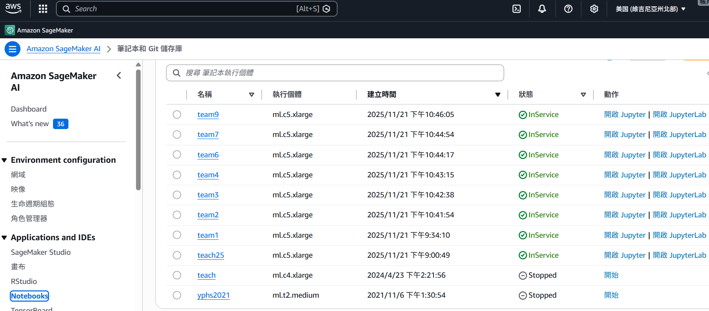
3. 點擊右側[**啟動**]，注意: 每次下課記得[**停止**]，此Lab只有20小時能用
4. 點擊[**開啟JupyterLab**]，畫面如下<br>
   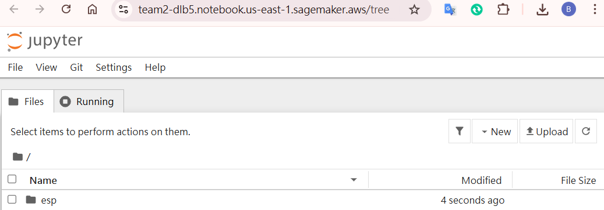
5. 點擊[**New**] > [**Terminal**]<br>
   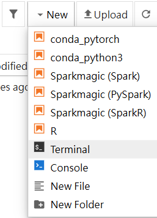
6. 記得都要先切換路徑 `cd SageMaker`<br>
   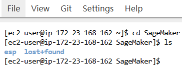
7. 在Amazon上Terminal上執行
   ```bash
   sudo yum update
   sudo yum install ninja-build
   
   mkdir esp
    
   cd ./esp
   git clone https://github.com/espressif/esp-dev-kits.git
   git clone --recursive https://github.com/espressif/esp-idf.git
   ```
8. install cmake (因為新版的sagemaker已有內建，故安裝指令可跳過)
   ```bash
   cd ./esp/esp-idf
   ./install.sh all
   source ./export.sh
   $IDF_PATH/tools/idf_tools.py install cmake
   ```
9. 每次開機都要執行
   ```bash
   ./install.sh all
   source ./export.sh
   ```


## Windows燒錄方法

由於在Amazon SageMaker AI訓練及建置的檔案，須於Local電腦透過傳輸線燒錄至ESP32-P4-EYE，以下提供Windows主機的操作步驟:

1. 透過傳輸線，插在ESP32-P4-EYE的**Debug Port**
2. 打開Windows的[裝置管理員]，確認[連接埠]是否有正常顯示裝置(e.g. COM3)<br>
   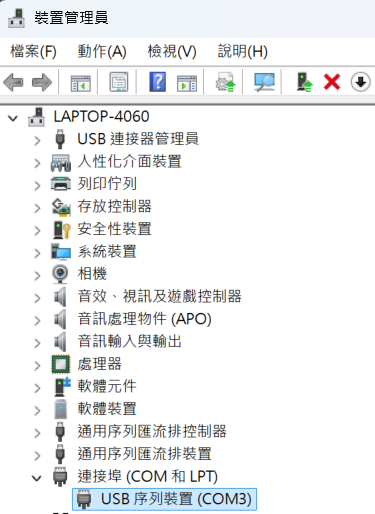
3. 下載[putty]程式來接收ESP32-P4-EYE的訊息，下載[網址](https://putty.org/index.html)，安裝完後點開設定，設定完可以按save存起來重複使用。<br>
   


## Lab1-Terminal
實作"Hellow world" example

1. `cd ~/SageMaker/esp/esp-idf`
2. `./install.sh all`
3. `source ./export.sh`
4. `cd ~/SageMaker/esp`
5. `git clone --recursive https://github.com/espressif/esp-idf.git
`
6. 從 IDF_PATH 環境變量指定的路徑復制 hello_world 範例到當前目錄：`cp -r $IDF_PATH/examples/get-started/hello_world .`
7. `cd hello_world/`
8. 執行 idf.py 工具進行配置，<br>
   `idf.py set-target esp32p4`<br>
   `idf.py menuconfig`
9. [Serial flasher config] > [Flash size]設定為4MB > 按下[S]做儲存 > ESC離開
10. 使用 idf.py 工具構建<br>
    `idf.py fullclean`<br>
    `idf.py build`
11. 建置成功後，下載以下3個檔案<br>
    build/bootloader/**bootloader.bin**<br>
    build/partition_table/**partition-table.bin**<br>
    build/**hello_world.bin**<br>
    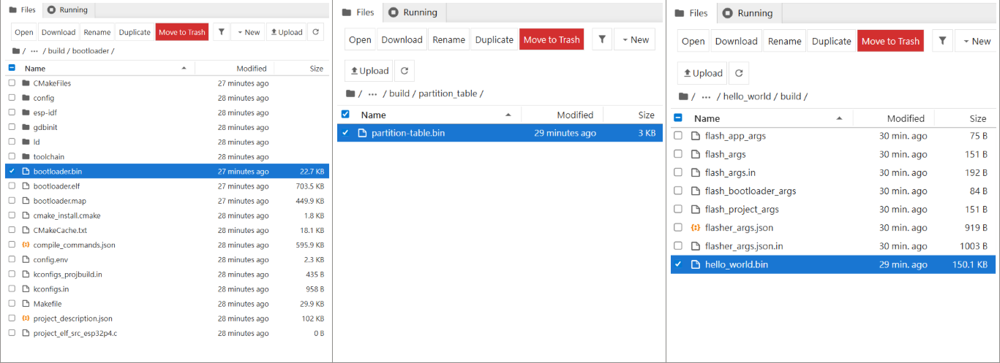
12. 於本機電腦插上數據線後，使用Python進行燒錄
    ```python
    python -m esptool -p COM3 --chip esp32p4 -b 115200 --no-stub --before default_reset --after hard_reset write_flash --flash_mode dio --flash_size 2MB --flash_freq 80m 0x2000 ./bootloader.bin 0x8000 ./partition-table.bin 0x10000 ./hello_world.bin
    ```
13. 開啟PuTTY，查看Terminal是否出現 Hello world! 文字<br>
    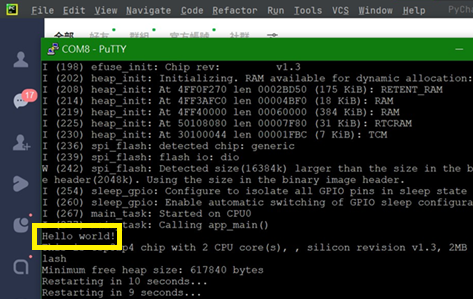
14. 燒錄程式範例檔，請參考外層的[Lab1-Terminal]資料夾


## Lab2-Factory
實作"Factory demo" example

1. esp-idf補丁流程
   - `cd ~/SageMaker/esp`
   - `git clone --recursive https://github.com/espressif/esp-dev-kits.git`
   - `cd esp-idf`
   - `git checkout release/v5.5`
   - 如下圖<br>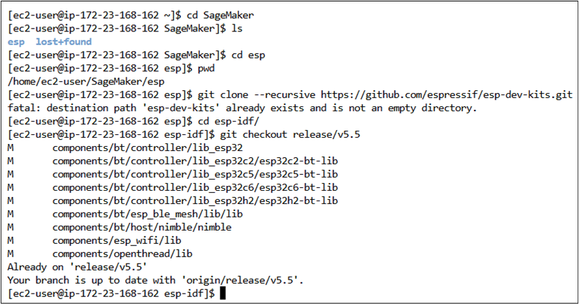
   - 切換至指定的 ESP-IDF 版本 `git checkout 98cd765953dfe0e7bb1c5df8367e1b54bd966cce`
2. `cd ~/SageMaker/esp/esp-idf`
3. `./install.sh all`
4. `source ./export.sh`
5. `idf.py menuconfig`<br>
   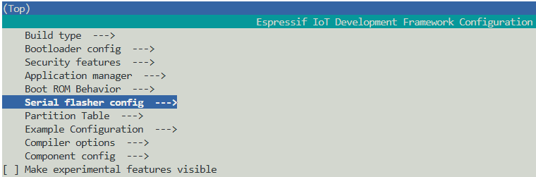<br>
   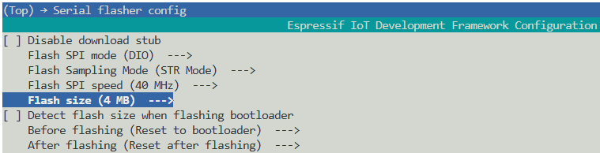<br>
   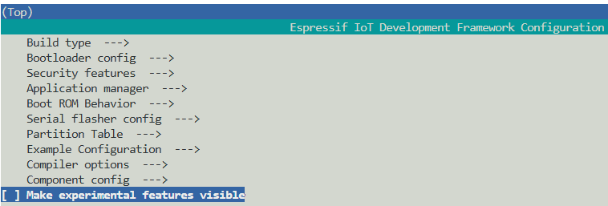<br>
   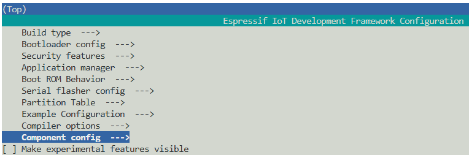<br>
   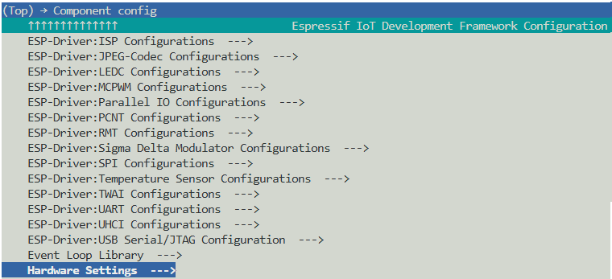<br>
   <br>
   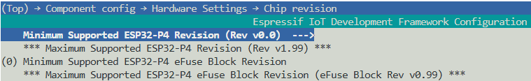<br>
   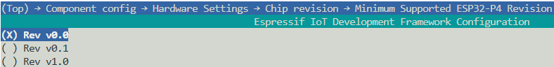<br>
   按S儲存<br>
   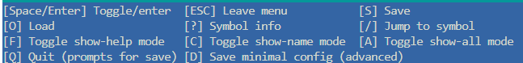
6. `idf.py set-target esp32p4`
7. `idf.py build`
8. build完成後，下載以下3個檔案<br>
   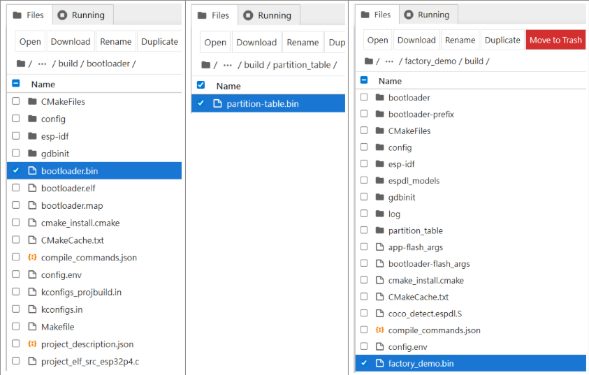
9. 下載到本機後，使用Python做燒錄<br>
   ```python
   python -m esptool -p COM3 --chip esp32p4 -b 115200 --no-stub --before default_reset --after hard_reset write_flash --flash_mode dio --flash_size 16MB --flash_freq 40m 0x2000 ./bootloader.bin 0x8000 ./partition-table.bin 0x10000 ./factory_demo.bin
   ```
10. 燒錄程式範例檔，請參考外層的[Lab2-Factory]資料夾


## Lab2-使用原廠範例燒錄
用於快速恢復原廠設定

1. 下載連結:<br>
   https://dl.espressif.com/AE/esp-dev-kits/p4_eye_factory_demo_100.bin
2. 本機燒錄指令
   ```python
   python3 -m esptool -p /dev/cu.usbmodem1101   --chip esp32p4   -b 115200 --no-stub  write_flash   0x0 p4_eye_factory_demo_100.bin
   ```
3. 已於課堂上快速復原成功<br>
   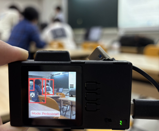

## Lab3-EnableCOCO
啟用AI detect的COCO功能

1. 修改模式定義 (./main/ui/ui_extra.h)<br>
   ```C
   typedef enum {
      AI_DETECT_PEDESTRIAN = 0, // Pedestrian detection
      AI_DETECT_FACE,           // Face detection
      AI_DETECT_COCO,           // 確定新增：COCO 物件偵測 (數值為 2)
      AI_DETECT_MODE_MAX        // Maximum number of modes
   } ai_detect_mode_t;
   ```
2. 更新 AI 處理邏輯 (./main/app/AI/app_ai_detect.cpp)<br>
   在 camera_dectect_task 函式中加入 COCO 偵測呼叫<br>
   ```C
   if (ui_extra_get_ai_detect_mode() == AI_DETECT_PEDESTRIAN) {
      detect_results = app_pedestrian_detect((uint16_t *)p->buffer, DETECT_WIDTH, DETECT_HEIGHT);
   } else if (ui_extra_get_ai_detect_mode() == AI_DETECT_FACE) {
      detect_results = app_humanface_detect((uint16_t *)p->buffer, DETECT_WIDTH, DETECT_HEIGHT);
   } else if (ui_extra_get_ai_detect_mode() == AI_DETECT_COCO) {
      // 呼叫來源中定義的 COCO 偵測函式
      detect_results = app_coco_detect((uint16_t *)p->buffer, DETECT_WIDTH, DETECT_HEIGHT);
   }
   ```

   在 app_ai_detection_process_frame 中串聯繪圖邏輯<br>
   ```C
   if(ai_detect_mode == AI_DETECT_FACE) {
      ret = app_humanface_ai_detect((uint16_t*)current_ai_buffer, (uint16_t*)detect_buf, width, height);
   } else if(ai_detect_mode == AI_DETECT_PEDESTRIAN) {
      ret = app_pedestrian_ai_detect((uint16_t*)current_ai_buffer, (uint16_t*)detect_buf, width, height);
   } else if(ai_detect_mode == AI_DETECT_COCO) {
      // 呼叫來源中已實作的繪製函式，它會處理 YOLO 框與文字標籤
      ret = app_coco_od_detect((uint16_t*)detect_buf, width, height); 
   }
   ```
3. 更新 UI 標籤顯示 (./main/ui/ui_extra.c)<br>
   修改 ui_extra_update_ai_detect_mode_label 函式<br>
   ```C
   static void ui_extra_update_ai_detect_mode_label(void) {
      if (ai_mode_label == NULL) return;

      if (current_ai_detect_mode == AI_DETECT_PEDESTRIAN) {
         lv_label_set_text(ai_mode_label, "Mode: Pedestrian");
      } else if (current_ai_detect_mode == AI_DETECT_FACE) {
         lv_label_set_text(ai_mode_label, "Mode: Face");
      } else if (current_ai_detect_mode == AI_DETECT_COCO) {
         lv_label_set_text(ai_mode_label, "Mode: COCO"); // 新增顯示文字
      }
   }
   ```
4. 實作 UI 按鈕切換邏輯 (./main/ui/ui_extra.c)<br>
   修改 ui_extra_btn_up 與 ui_extra_btn_down 的 switch-case 邏輯，使其支援三個模式的循環切換<br>
   向下按鈕 (Next Mode)<br>
   ```C
   case UI_PAGE_AI_DETECT:
      if (current_ai_detect_mode == AI_DETECT_PEDESTRIAN) {
         ui_extra_change_ai_detect_mode(AI_DETECT_FACE);
      } else if (current_ai_detect_mode == AI_DETECT_FACE) {
         ui_extra_change_ai_detect_mode(AI_DETECT_COCO); // 切換至 COCO
      } else {
         ui_extra_change_ai_detect_mode(AI_DETECT_PEDESTRIAN); // 循環回第一個
      }
      break;
   ```
   向上按鈕 (Prev Mode)<br>
   ```C
   case UI_PAGE_AI_DETECT:
      if (current_ai_detect_mode == AI_DETECT_PEDESTRIAN) {
         ui_extra_change_ai_detect_mode(AI_DETECT_COCO); // 回到最後一個 (COCO)
      } else if (current_ai_detect_mode == AI_DETECT_COCO) {
         ui_extra_change_ai_detect_mode(AI_DETECT_FACE);
      } else {
         ui_extra_change_ai_detect_mode(AI_DETECT_PEDESTRIAN);
      }
      break;
   ```
5. 後續一樣的燒錄步驟<br>
   ```
   cd ~/SageMaker/esp/esp-idf
   ./install.sh all
   source ./export.sh

   idf.py set-target esp32p4
   idf.py menuconfig
   idf.py build
   ```
6. 下載到本機後，使用Python做燒錄<br>
   ```python
   python -m esptool -p COM3 --chip esp32p4 -b 115200 --no-stub --before default_reset --after hard_reset write_flash --flash_mode dio --flash_size 16MB --flash_freq 40m 0x2000 ./bootloader.bin 0x8000 ./partition-table.bin 0x10000 ./factory_demo.bin
   ```
7. 燒錄程式範例檔，請參考外層的[Lab3-EnableCOCO]資料夾


##  Lab4-FinalProject
使用roboflow資料集，於AWS上使用Pytorch訓練YOLO模型，並透過onnx中繼交換格式及量化，轉出最後的espdl檔案

1. 選定資料集，我們是採用"Highway"為關鍵字，資料集連結如下<br>
   https://universe.roboflow.com/maksim-nezis/highway-aaxmv 
2. 在SageMaker確認kernal<br>
   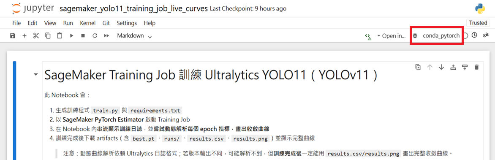
3. 找到我們組別的S3<br>
   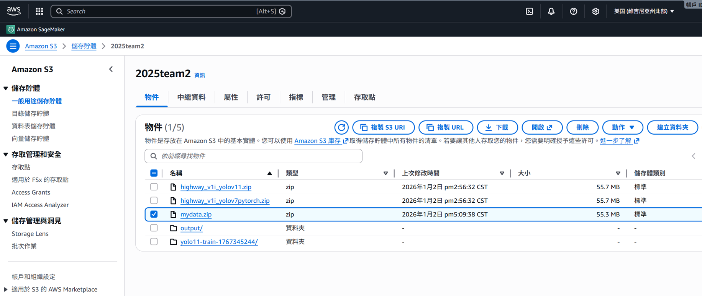
4. Python語法<br>
   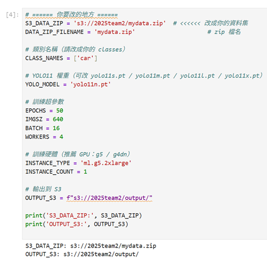
5. 開始訓練<br>
   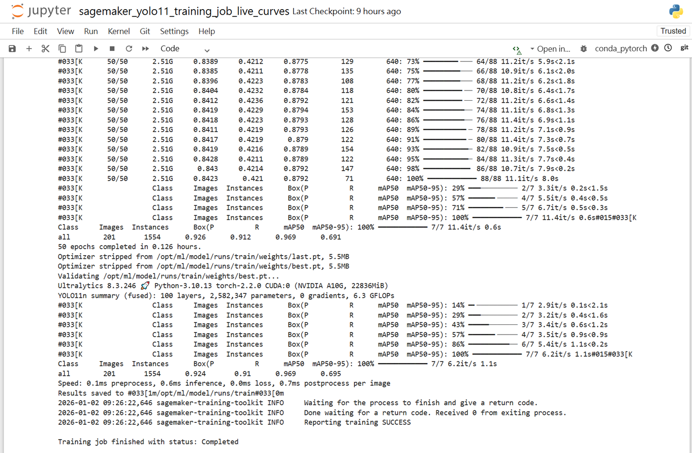
6. 確認Loss、Precision、Recall、mAP<br>
   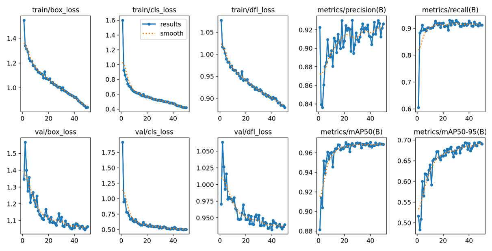
7. 確認模型偵測結果<br>
   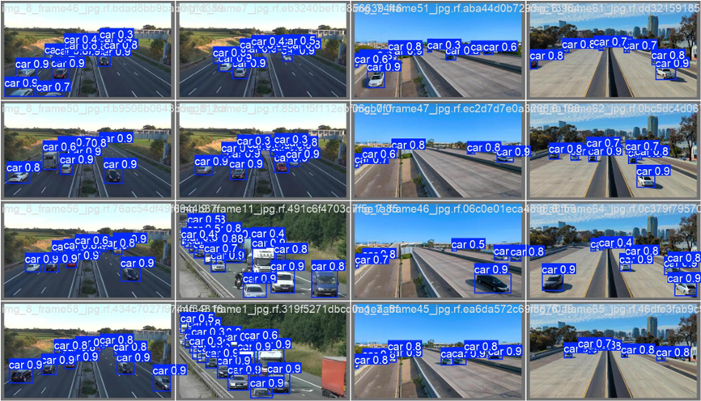
8. 於本機實測best.pt於台灣的高速公路<br>
   程式碼請參考: [本專案檔案-highway.ipynb](../Lab4-FinalProject/highway.ipynb)<br>
   推論影片請參考: [本專案檔案-Tw-Highway-1.avi](../Lab4-FinalProject/runs/detect/predict/Tw-Highway-1.avi)
   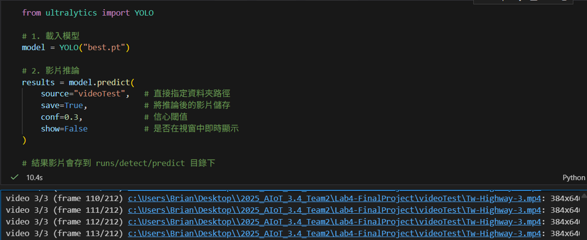
9. 轉換為ONNX(中繼交換格式)，請參考 [export_onnx.ipynb檔案](../Lab4-FinalProject/export_onnx.ipynb)
10. 參考官方文件 `quantize_torch_model.py` 與 `quantize_onnx_model.py`做量化與導出espdl<br>
    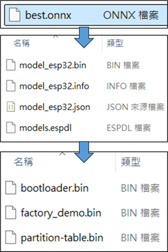
11. 完成燒錄<br>
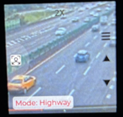


## Lab4-ESP32CAM + 邊緣運算
1. 如同講師上課說的，Edge AI 永遠在 trade-off<br>
   不存在「又快又準又省」
2. 我們這組有在實作另外一個架構，<br>
   透過ESP32-CAM作為視訊串流，讓更強大算利的邊緣裝置(e.g. RTX GPU顯卡、Jetson系列主機、Raspberry Pi AI Kit...等)直接做推論，將不在受限於MCU運算能力有限的問題。<br>
   此架構可以得到又快又準的效能，但缺點就是貴。<br>
   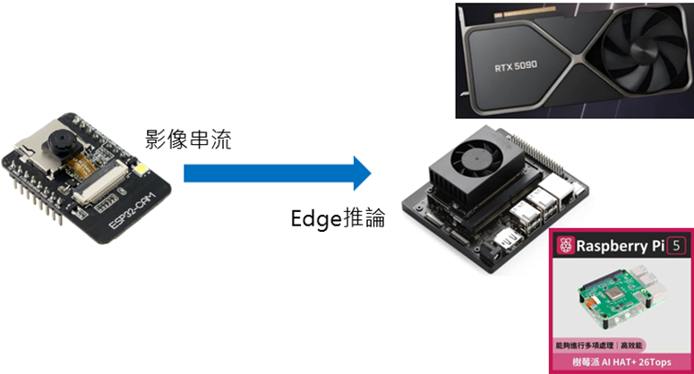
3. 以下Demo以ESP32-CAM搭配RTX4060筆電，可參考此[影片連結](https://youtu.be/J6QC_sI40TM?si=nECJnIXF58tQfVe4)