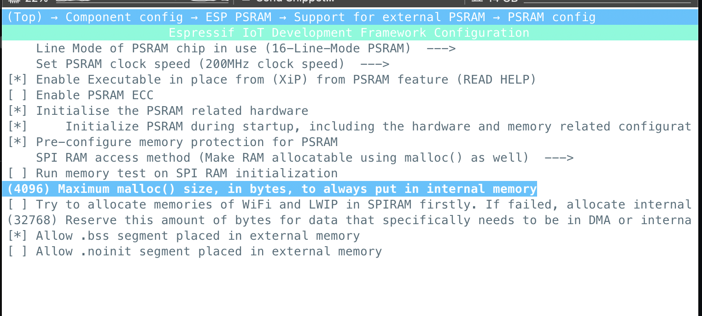
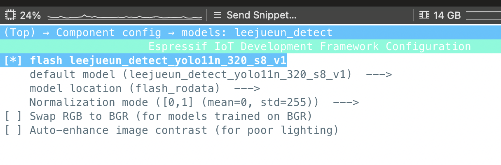
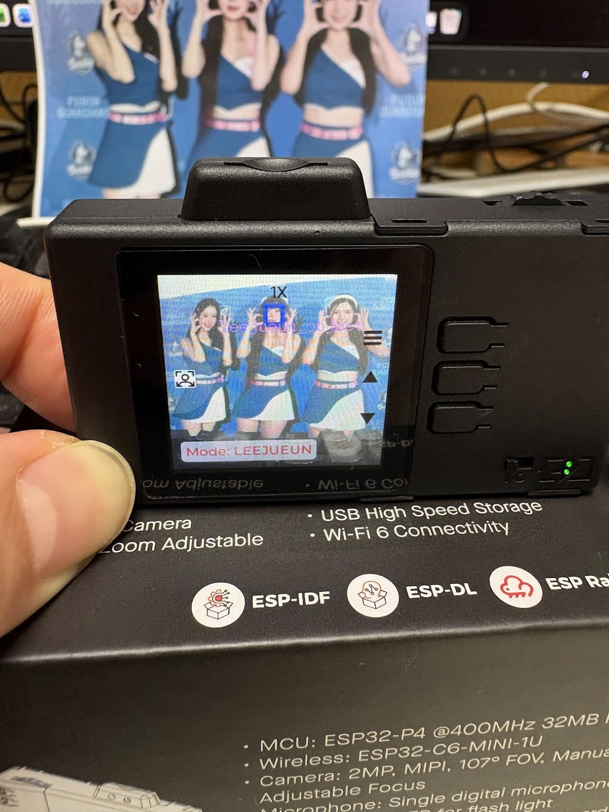
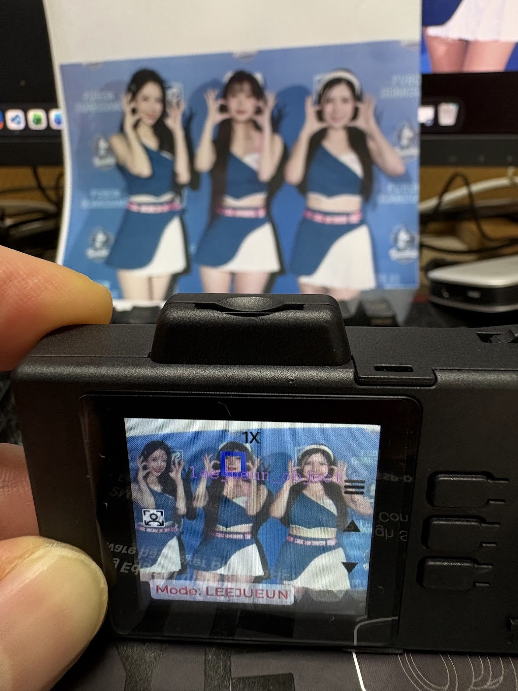

# 2025_AIoT_Team5：完成更新模型操作（ESP32-P4 整合 + 記憶體設定）


---

## 1. 作業目標

- 將 `.espdl` 模型整合進 ESP32-P4 `factory_demo`
- 新增 AI Detect 模式：**LEEJUEUN**（李珠珢人臉偵測）
- 透過 `menuconfig` 解決記憶體不足（PSRAM）
- 成功燒錄並在板子上看到偵測框（bounding box）

> 本 PR 不重新教模型訓練；訓練/匯出/量化流程在 "2025_AIoT_Team5：完成自訓練偵測模式"

---

## 2. 專案修改說明（依照實作概念整理）

### 2.1 新增 component：`leejueun_detect`

- 基於既有 detect 架構延伸
- 具備獨立 Kconfig
- 支援（依你專案設定）：
  - normalization mode
  - RGB/BGR
  - contrast enhancement

### 2.2 新增 menuconfig 設定（模型相關）

以下為本專案要能跑起來的關鍵設定路徑（文字版）：

```text
Component config →
  models: leejueun_detect →
    [*] flash leejueun_detect_yolo11n_320_s8_v1
    default model → leejueun_detect_yolo11n_320_s8_v1
    model location → flash_rodata
    Normalization mode → [0,1]
```

---

## 3. 解決 ESP32-P4 記憶體不足（PSRAM 必做）

### 3.1 PSRAM 設定（menuconfig）

路徑：

```text
Component config →
  ESP PSRAM →
```

請確認以下設定：

- `Enable external PSRAM`：✅
- `Initialize PSRAM during startup`：✅
- `Allow .bss segment placed in external memory`：✅
- `Maximum malloc() size, in bytes, to always put in internal memory`：設為 **4096**

#### 設定截圖





---

## 4. 為什麼模型建議放 `flash_rodata`

### 4.1 可能遇到的問題（SD card / 外部載入）

- I/O 較慢
- 記憶體碎片化風險提高
- detect 過程更容易 crash（不穩定、不可重現）

### 4.2 本專案做法

- 模型採 `flash_rodata`
- 開機即可穩定載入
- 更容易讓助教/老師按步驟重現

---

## 5. AI Detect 程式調整重點（推論結果穩定化）

### 5.1 Threshold（範例）

```cpp
conf = 0.25
nms  = 0.7
topk = 10
```

### 5.2 Box 修正與 clamp

- 防止畫框超出螢幕邊界
- 避免 painter 在極端座標時出錯

### 5.3 影像格式對齊

本專案使用：

```cpp
DL_IMAGE_CAP_RGB565_BIG_ENDIAN
```

---

## 6. Build & Flash

在 factory_demo 專案目錄：

```bash
idf.py build
idf.py flash monitor
```

---

## 7. Demo

### 7.1 偵測畫面截圖




### 7.2 功能說明

- 進入 `AI Detect` → `LEEJUEUN` 模式
- 可即時偵測畫面中的李珠珢臉部
- 顯示 bounding box 與 label
